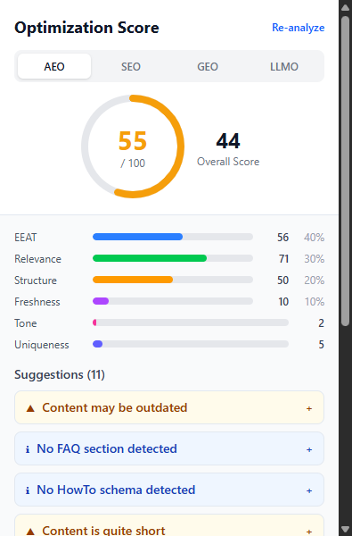

# AEO Score Calculator — Chrome Extension

<p align="center">
  
  
  
  
  
  
</p>

<p align="center">
  <strong>Score your webpage for SEO, GEO, LLMO & AEO — all running 100% locally in your browser.</strong>
</p>

<p align="center">
  <strong>Keywords:</strong> AEO · SEO · GEO · LLMO · Answer Engine Optimization · Generative Engine Optimization · LLM Optimization · Chrome Extension · Privacy-First · Transformers.js
</p>

---

## 🚀 What It Does

AEO Score Calculator is a **Chrome Manifest V3 extension** that analyzes any webpage and returns a comprehensive optimization score across **four disciplines**:

| Category | Focus | Score Range |
|----------|-------|-------------|
| **AEO** | Answer Engine Optimization (EEAT, Relevance, Structure, Freshness) | 0–100 |
| **SEO** | Search Engine Optimization (Technical, On-Page, Links, Images) | 0–100 |
| **GEO** | Generative Engine Optimization (Citations, Statistics, Structured Answers) | 0–100 |
| **LLMO** | LLM Optimization (Crawlability, Completeness, Direct Answers, Clarity) | 0–100 |

An **overall score** combines all four categories into a single number. Each category includes actionable suggestions ranked by severity (critical, warning, info).

---

## ✨ Features

- **4-in-1 Scoring Engine** — SEO, GEO, LLMO, and AEO scores in a single click
- **100% Local Processing** — All analysis runs in-browser via Transformers.js. No data leaves your machine
- **Local LLM Inference** — DistilBERT (sentiment) and MiniLM (embeddings) run locally — no API keys, no network calls
- **Actionable Suggestions** — Prioritized recommendations: critical issues, warnings, and improvement tips
- **Tabbed Dashboard** — Switch between AEO, SEO, GEO, and LLMO views with category-specific breakdowns
- **Privacy-First Architecture** — Zero telemetry, zero tracking, zero external requests
- **Offline-Ready** — Models are bundled locally (~88 MB). Works without an internet connection

---

## 📸 Screenshots

<p align="center">
  
  <br/>
  <em>Extension popup with AEO/SEO/GEO/LLMO tabs and score breakdown</em>
</p>

---

## 📦 Installation

### Option 1: Load Unpacked (Recommended for Development)

1. **Clone the repository**
   ```bash
   git clone https://github.com/YOUR_USERNAME/aeo-score-calculator.git
   cd aeo-score-calculator
   ```

2. **Install dependencies and build**
   ```bash
   bun install
   bun run build
   ```

3. **Load in Chrome**
   - Open `chrome://extensions/`
   - Enable **Developer mode** (top-right toggle)
   - Click **Load unpacked**
   - Select the `dist/` folder

### Option 2: Chrome Web Store

> 🚧 Coming soon. Subscribe to this repo for release notifications.

---

## 🎮 How to Use

1. **Navigate** to any webpage you want to analyze
2. **Click the extension icon** in your Chrome toolbar
3. **Click "Analyze Current Page"**
4. **Switch tabs** to view AEO, SEO, GEO, or LLMO scores
5. **Review suggestions** for each category and implement improvements

### ⌨️ Keyboard Shortcut

Set a custom shortcut for instant analysis:

1. Go to `chrome://extensions/shortcuts`
2. Find **AEO Score Calculator**
3. Assign your preferred shortcut (e.g., `Ctrl+Shift+A` or `⌘+Shift+A`)
4. Press your shortcut on any page to open the analyzer

---

## 📊 Understanding Your Score

### Overall Score Ranges

| Score | Rating | What It Means |
|-------|--------|---------------|
| **80–100** | 🟢 Excellent | Well-optimized across all disciplines |
| **60–79** | 🔵 Good | Solid foundation with room for improvement |
| **40–59** | 🟡 Needs Work | Several areas need attention |
| **0–39** | 🔴 Significant Optimization Needed | Major improvements required |

### Category Breakdowns

Each category shows sub-scores with their weights:

**AEO** — EEAT (40%), Relevance (30%), Structure (20%), Freshness (10%) + LLM bonuses
**SEO** — Technical (30%), On-Page (35%), Link Profile (20%), Image SEO (15%)
**GEO** — Citability (30%), Factual Density (25%), Structured Answers (25%), Authority (20%)
**LLMO** — Crawlability (20%), Completeness (30%), Direct Answers (30%), Clarity (20%)

---

## ✅ AEO Score Validation

The scoring engine uses a combination of **heuristic analysis** and **local LLM inference** to evaluate your page:

### Heuristic Scoring (No LLM)
- **EEAT**: Author presence, citations, schema markup, trust signals, content depth
- **Relevance**: Title quality, meta description, heading structure, content depth, images
- **Structure**: Heading hierarchy, lists, tables, paragraphs, images
- **Freshness**: Age-based decay — <30d=1.0, <90d=0.7, <180d=0.4, older=0.1
- **SEO Technical**: Canonical URL, viewport, HTTPS, semantic HTML, H1 count
- **SEO On-Page**: Title length, description length, heading count, word count
- **GEO Citability**: Quotation count, statistics density, citation patterns, external links
- **GEO Structured Answers**: FAQ presence, comparison tables, step-by-step guides, answer capsules

### LLM Scoring (Local Inference)
- **Tone**: DistilBERT sentiment analysis — positive/negative sentiment confidence
- **Uniqueness**: MiniLM text embeddings — embedding magnitude as uniqueness proxy

### What's NOT Scored (Yet)
- Backlink profile (requires external data)
- Core Web Vitals (requires Performance API access)
- Domain authority (requires external data)
- Social signals (requires external data)

---

## 🛠 Tech Stack

| Technology | Version | Purpose |
|------------|---------|---------|
| **Chrome Manifest V3** | v3 | Extension platform |
| **Vite** | v6 | Build tool + dev server |
| **CRXJS** | v2 | Vite plugin for Chrome extensions |
| **React** | v19 | Popup UI |
| **TypeScript** | v5.7 | Type-safe development |
| **Tailwind CSS** | v4 | Utility-first styling |
| **Transformers.js** | v2.17 | In-browser LLM inference |
| **ONNX Runtime Web** | v1.14 | WASM-based model execution |
| **Vitest** | v3 | Unit testing |

---

## 🗺 Roadmap

| Priority | Feature | Status |
|----------|---------|--------|
| 🔴 High | Chrome Web Store publication | 🚧 In Progress |
| 🔴 High | Core Web Vitals integration | 📋 Planned |
| 🟡 Medium | Historical score tracking | 📋 Planned |
| 🟡 Medium | Export results as PDF/JSON | 📋 Planned |
| 🟡 Medium | Batch URL analysis | 📋 Planned |
| 🟢 Low | Firefox / Edge support | 💡 Idea |
| 🟢 Low | Custom scoring weights | 💡 Idea |
| 🟢 Low | AI-powered suggestion generation | 💡 Idea |

---

## 🏗 Architecture

```
┌─────────┐    ANALYZE_PAGE    ┌────────────┐  EXTRACT_CONTENT  ┌──────────────┐
│  Popup  │ ──────────────────► │ Background │ ────────────────► │ Content      │
│ (React) │ ◄────────────────── │ (SW)       │ ◄──────────────── │ Script       │
│         │   AnalysisResult    │            │   ExtractedContent│              │
└─────────┘                     └─────┬──────┘                   └──────────────┘
                                      │
                    CALCULATE_LLM     │
                    ─────────────────►│◄──────────────────────────┐
                    LLM Scores        │                           │
                                      ▼                           │
                               ┌─────────────┐                    │
                               │  Offscreen   │                    │
                               │  Document    │                    │
                               │ (Transformers│                    │
                               │  .js)        │                    │
                               └──────────────┘                    │
```

---

## 📁 Project Structure

```
├── manifest.config.ts          # MV3 manifest definition
├── vite.config.ts              # Vite + CRXJS configuration
├── popup.html                  # Popup HTML entry
├── offscreen.html              # Offscreen document for LLM
├── public/models/              # Local ML models (~88 MB)
├── scripts/
│   └── download-models.ts      # Script to download models from HuggingFace
├── src/
│   ├── background/             # Service worker (DOM-free)
│   ├── content/                # Content script (DOM extraction)
│   ├── offscreen/              # Offscreen document (Transformers.js)
│   ├── popup/                  # React 19 popup UI
│   ├── lib/
│   │   ├── types.ts            # Shared TypeScript interfaces
│   │   ├── aeo-calculator.ts   # Main calculator + finalizeAll
│   │   ├── aeo-scoring.ts      # AEO heuristic scoring
│   │   ├── aeo-extraction.ts   # DOM extraction functions
│   │   ├── seo-scoring.ts      # SEO scoring module
│   │   ├── geo-scoring.ts      # GEO scoring module
│   │   ├── llmo-scoring.ts     # LLMO scoring module
│   │   ├── llm/                # Local LLM inference
│   │   └── messaging/          # Typed messaging system
│   └── components/             # React UI components
├── tests/                      # Vitest unit tests
├── icons/                      # Extension icons
└── dist/                       # Built extension (load in Chrome)
```

---

## 📝 Commands

```bash
bun install              # Install dependencies
bun run dev              # Development with hot reload
bun run build            # Production build → dist/
bun run test             # Watch mode tests
bun run test:run         # Single-run tests
bun run download-models  # Download ML models from HuggingFace
```

---

## 🤝 Contributing

Contributions are welcome! Please feel free to submit a Pull Request.

1. Fork the repository
2. Create your feature branch (`git checkout -b feature/amazing-feature`)
3. Commit your changes (`git commit -m 'Add amazing feature'`)
4. Push to the branch (`git push origin feature/amazing-feature`)
5. Open a Pull Request

---

## 📄 License

This project is licensed under the MIT License — see the [LICENSE](LICENSE) file for details.

---

## 🏷 Recommended Repository Topics

Add these topics to your GitHub repository for maximum discoverability:

```
aeo, seo, geo, llmo, answer-engine-optimization, generative-engine-optimization, llm-optimization, chrome-extension, manifest-v3, transformers-js, privacy-first, local-llm, content-optimization, react-extension, typescript, vite, eeat, ai-search, search-engine-optimization, web-optimization
```

**Why these topics?**
- **Core keywords** (`aeo`, `seo`, `geo`, `llmo`) — match what developers search for
- **Full terms** (`answer-engine-optimization`, `generative-engine-optimization`) — catch long-tail searches
- **Tech stack** (`chrome-extension`, `manifest-v3`, `transformers-js`, `react-extension`) — attract developers
- **Use case** (`privacy-first`, `local-llm`, `content-optimization`) — attract end users
- **Related** (`eeat`, `ai-search`, `perplexity-optimization`) — catch adjacent searches
